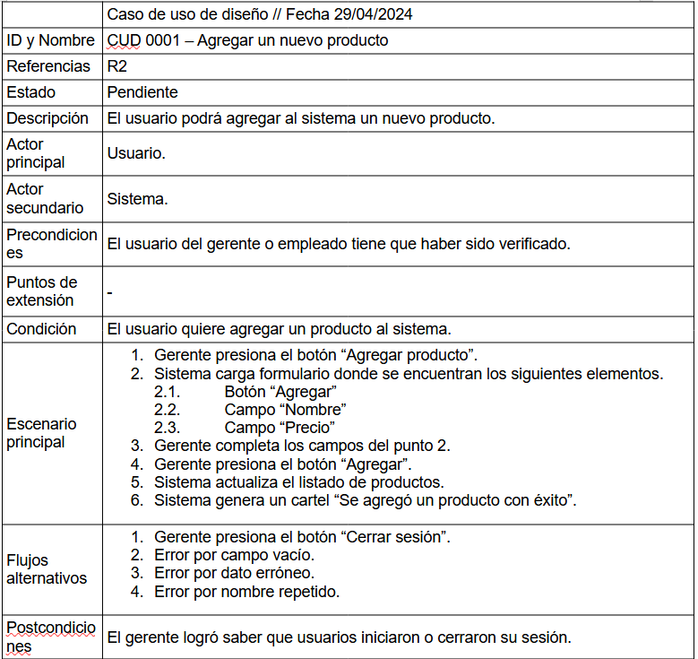

# Ejercicio 8

## Análisis de Requerimientos

### Ejercicio 1

- Requerimientos funcionales

1. La aplicación web tiene que ver cuantas existencias hay en el inventario
2. La aplicación web tiene que ser capaz de agregar productos
3. La aplicación web tiene que ser capaz de remover productos
4. La aplicacion web tiene que ser capaz de modificar productos

- Requerimientos no funcionales

1. La aplicación web no tiene que tardar en cargar cualquier lista más de 5 milisegundos
2. La aplicacion web tiene que resistir la vulnerabilidad de SQL Inyection
3. La interfaz de la aplicacion web tiene que ser amigable para el usuario

### Ejercicio 2

Titulo: Agregar un nuevo producto

## Diseño del Sistema

### Ejercicio 3

### Ejercicio4

## Diseño del Programa

### Ejercicio 5

La arquitectura que me parece adecuada para la aplicación web es la
modelo-vista-controladora (MVC), ya que delimita de forma eficiente los
componentes que contendrá la aplicación.

### Ejercicio 6

## Diseño

#### Diagrama de Dominio

#### Diagrama de Robustez

#### Prototipo

#### Diagrama de Secuencia

#### Diagrama de Clases

