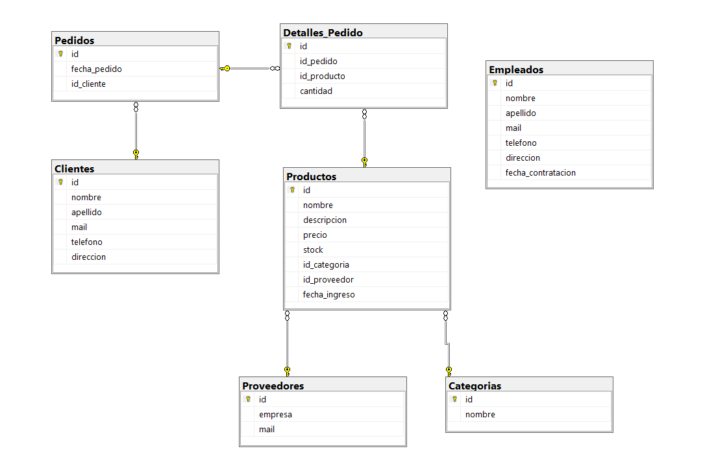

## 3. Diseño del Programa:

### Ejercicio 6:
Diseña la base de datos para la aplicación web del ejercicio 1.

##### Tabla: Productos
- id (Clave primaria, autoincremental)
- nombre 
- descripcion 
- precio
- stock 
- id_categoria (Clave foránea referenciando la tabla Categorias)
- id_proveedor (Clave foránea referenciando la tabla Proveedores)
- fecha_ingreso

##### Tabla: Clientes
- id (Clave primaria)
- nombre 
- apellido 
- mail 
- telefono 
- direccion 

##### Tabla: Categorias
- id (Clave primaria)
- nombr

##### Tabla: Proveedores
- id (Clave primaria)
- empresa 
- mail 

##### Tabla: Pedidos
- id (Clave primaria, autoincremental)
- fecha_pedido 
- id_cliente (Clave foránea referenciando la tabla Clientes)

##### Tabla: Detalles_Pedido
- id (Clave primaria)
- id_pedido (Clave foránea referenciando la tabla Pedidos)
- id_producto (Clave foránea referenciando la tabla Productos)
- cantidad 

##### Tabla: Empleados
Empleados
- id (Clave primaria)
- nombre 
- apellido 
- mail 
- telefono 
- direccion 
- fecha_contratacion