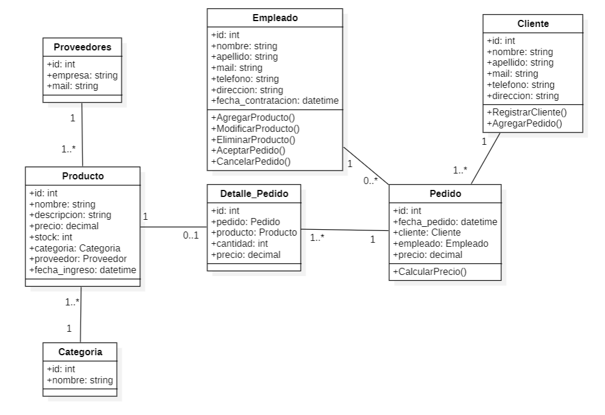
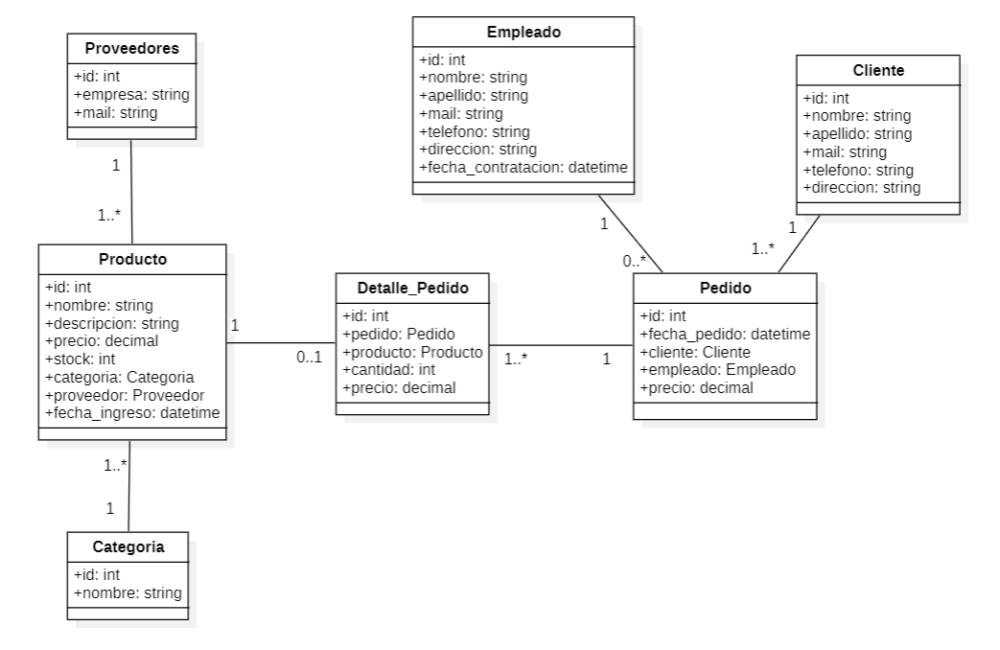
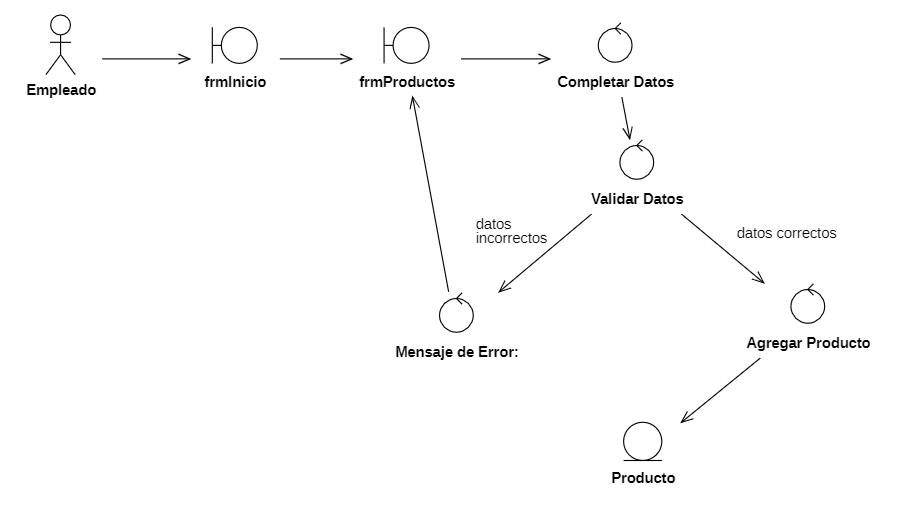
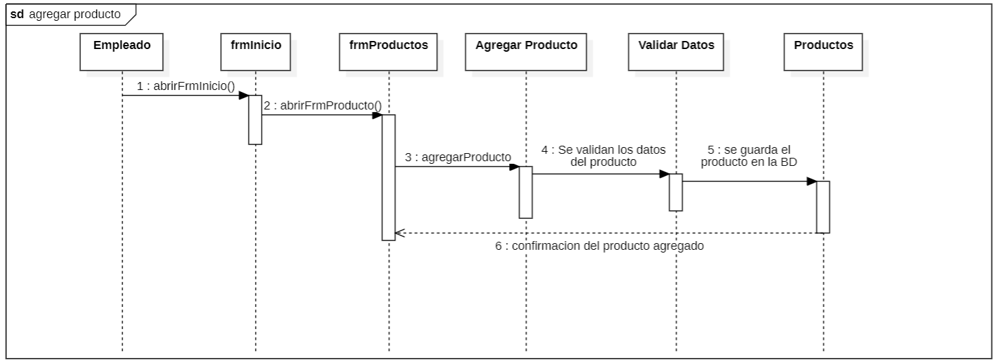

## 4. Diseño:

Utilizando los siguientes diagrama resuelva los casos de usos de los  ejercicios 7 y 8: 

1. Diagrama de Dominio: Identifica las entidades, atributos y relaciones del sistema.
2. Diagrama de Robustez: Analiza cómo el sistema responde a diferentes escenarios de uso.
3. Prototipo: Crea una versión simplificada del sistema para probar la usabilidad y funcionalidad.
4. Diagrama de Secuencia: Describe la interacción entre los diferentes objetos del sistema.
5. Diagrama de Clases: Define las clases, sus atributos, métodos y relaciones

### Ejercicio 7: 
Implementa la funcionalidad de "Agregar un nuevo producto" en la aplicación web del ejercicio 1 utilizando el lenguaje de programación de tu preferencia.

#### Diagrama De Clases

#### Diagrama De dominio

#### Diagrama De Robustez

#### Diagrama de Secuencia

