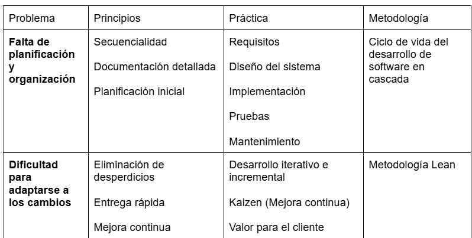
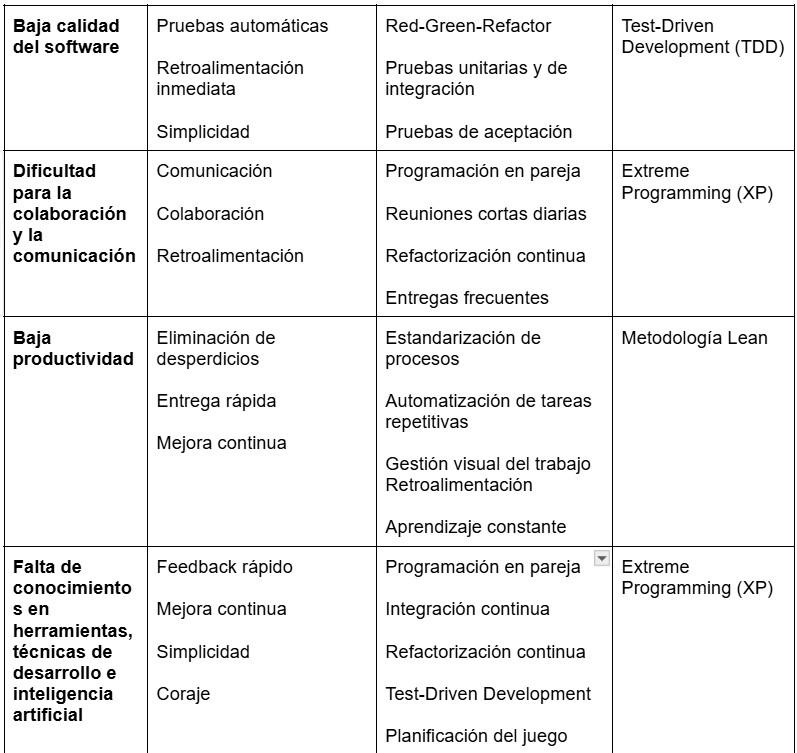
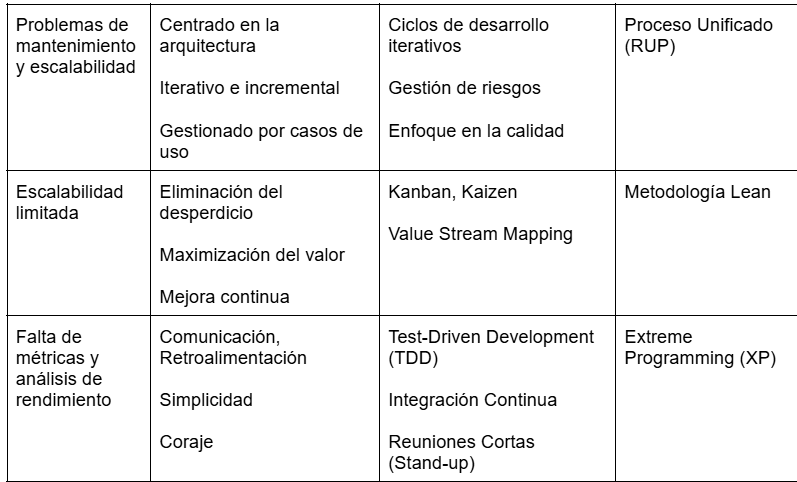
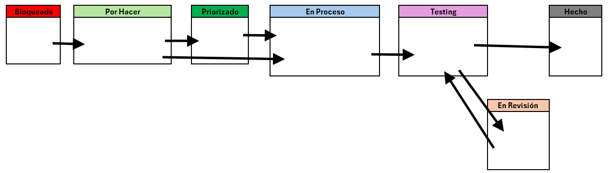

# Primer Parcial
Sebastian Febre

## 1. Identifique tres nuevas problemáticas de las enunciadas anteriormente

**Problemas de mantenimiento y escalabilidad:** La ausencia de buenas prácticas y arquitecturas bien definidas puede generar dificultades en el mantenimiento y escalabilidad de los sistemas.

**Incapacidad para manejar proyectos más grandes o un aumento en la cantidad de clientes:** Sin metodologías adecuadas y herramientas modernas, la empresa puede tener dificultades para escalar sus operaciones y manejar una mayor carga de trabajo.

**Ausencia de un sistema de evaluación y mejora continua:** Sin un sistema para medir y analizar el rendimiento del desarrollo de software, la empresa no puede identificar áreas de mejora ni evaluar la efectividad de los cambios implementados.

##  2. 

## 3. Diseño del Tablero Kanban

**Bloqueado**
- Esta columna es para tareas que no pueden avanzar debido a algún impedimento (falta de otra tarea por hacer).

*Problemática Abordada:*
* Falta de planificación y organización: Identifica y visualiza rápidamente los obstáculos que están impidiendo el progreso.
* Dificultad para adaptarse a los cambios: Permite una rápida identificación de problemas que requieren conocimientos específicos.

**Por Hacer**
- Aquí se colocan todas las tareas pendientes que aún no han sido iniciadas.

*Problemática Abordada:*
* Falta de planificación y organización: Proporciona una vista clara de todas las tareas que están esperando ser iniciadas, facilitando la planificación.
* Dificultad para adaptarse a los cambios: Al centralizar las tareas, se reduce la dependencia del conocimiento individual.

**Priorizado**
- Una lista priorizada de todas las tareas pendientes que tienen mas importancia que las de la columna"Para Hacer".

*Problemática Abordada:*
* Falta de planificación y organización: Ayuda en la planificación a largo plazo y en la priorización de tareas.

**En Proceso**
- Esta columna contiene tareas que están actualmente en desarrollo.

*Problemática Abordada:*
* Falta de métricas y análisis de rendimiento: Facilita la medición del tiempo que las tareas pasan en desarrollo, ayudando a identificar cuellos de botella.
* Baja productividad: Facilita la medición del tiempo que las tareas pasan en desarrollo, ayudando a identificar cuellos de botella.

**Testing** 
- Las tareas que están siendo probadas se colocan en esta columna.

*Problemática Abordada:*
* Problemas de mantenimiento y escalabilidad: Garantiza que el software funciona correctamente antes de ser liberado.
* Ausencia de un sistema de evaluación y mejora continua: Permite rastrear el tiempo dedicado a pruebas y detectar fallos recurrentes.
* Baja calidad del software: Asegura que el código cumpla con los estándares antes de ser fusionado, mejorando la calidad del software.

**Revisión**
- Aquí se colocan las tareas que no pasaron el testing y estan listas para ser revisadas por otro desarrollador.

*Problemática Abordada:*
* Problemas de mantenimiento y escalabilidad: Asegura que el código cumpla con los estándares antes de ser fusionado, mejorando la calidad del software.
* Baja calidad del software: Asegura que el código cumpla con los estándares antes de ser fusionado, mejorando la calidad del software.
* Dificultad para la colaboración y la comunicación: La revisión por pares difunde el conocimiento del código entre varios miembros del equipo.

**Hecho**
- Las tareas completadas y aprobadas se mueven a esta columna.

*Problemática Abordada:*
* Dificultad en la gestión de proyectos: Proporciona una vista clara del trabajo completado, facilitando el control del progreso.
* Ausencia de un sistema de evaluación y mejora continua: Ayuda a evaluar el rendimiento y la productividad del equipo al revisar las tareas finalizadas.

