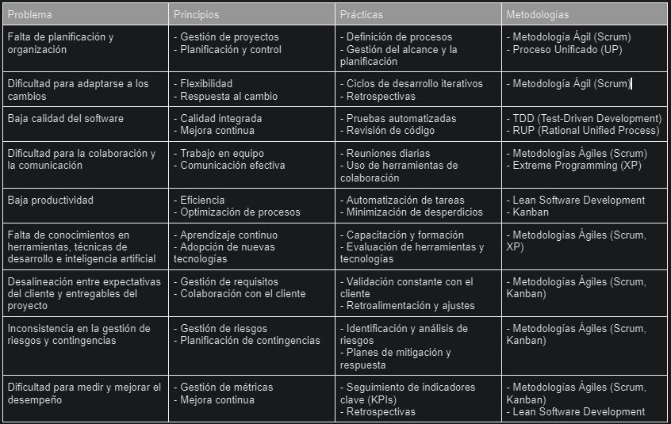
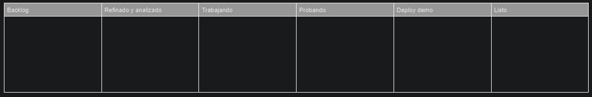

# 1. Podriamos considerar las siguientes problemáticas como posibles dentro de la empresa, originadas por falta de aplicación de metodologías ágiles:
    
    - Desalineación entre expectativas del cliente y entregables del proyecto:
    Se producen diferencias entre lo que espera el cliente, y lo que se entrega. Esto produce demoras en el proceso del desarrollo del software, inconsistencias y descontentos por parte del cliente.

    - Inconsistencia en la gestión de riesgos y contingencias:
    Se generan confusiones y no se manejan con certeza los riesgos, por una mala identificacion del origen de los mismos.

    - Dificultad para medir y mejorar el desempeño:
    Se generan dificultades a la hora de medir y gestionar el desempeño de los colaboradores en la empresa. Esto puede estar relacionado con entregas de baja calidad del software.

# 2. Tabla para indicar principios y prácticas de las metodologías con las que abordar todas las problematicas de la cooperativa:

# 3. Tablero Kanban a utilizar por la empresa

<b>Backlog:</b> Acá se incorporan nuevos problemas a medida que se identifican. El problema deberá contar, como mínimo, con una descripción, casos de uso, resultado esperado, y resultado obtenido (no es el esperado, por eso es un problema). Cumple con un criterio Push, se agregan al iniciar las problemáticas. 

<b>Refinado y Analizado:</b> Una vez que tenemos el problema claro, los desarrolladores ya identifican y reproducen el caso en que falla, mediante un criterio Pull nos traemos de la columna Backlog el problema/ticket. El equipo ya pudo analizarlos y está listo para trabajar en ellos. 

<b>Trabajando:</b> En este caso, mediante un esquema pull vamos a ir trayendo uno a uno los tickets/problemas (ya previamente refinados y analizados) en donde se esté trabajando en tiempo real, cuando el equipo invierte su capacidad para trabajar en ellos. 

<b>Probando:</b> Una vez que el trabajo está finalizado, mediante el criterio push se envía el ticket/problema a la columna de probando, donde deberá testear la solución propuesta por el equipo, para asegurar calidad y eficiencia en la resolución de la problemática.

<b>Deploy Demo:</b> Aquí se colocarán los tickets resueltos, listos para mostrar al cliente en una DEMO, para poder llevar adelante las entregas constantes de valor correspondientes a las metodologías que utilizamos, y obtener un feedback de las soluciones propuestas.

<b>Listo:</b> Lugar en donde se almacenan los tickets ya terminados, con una satisfactoria solución y aprobados por el cliente luego de la Demo. Permite además, llevar un historial de los problemas resueltos, que siempre es importante conservar.

 

<i>Elegí una estructura de tablero kanban como esta, ya que día a día la utilizamos en la empresa donde trabajo, donde aplicamos metodologías ágiles desde hace no mucho tiempo. Pude observar el proceso de adaptación y los resultados obtenidos desde la aplicación de estas metodologías son increibles. Mejoro mucho la comunicacón, la calidad de los entregables, y el feedback/relacion con el cliente, entre otras cosas.</i>

 
 

<b>Problemáticas que aborda cada sección del tablero Kanban:</b>

Backlog: 
- Prob. 1, al contar con un backlog donde se incorporan y priorizan los problemas a resolver.
- Prob. 7, al requerir que cada problema cuente con una descripción, casos de uso, resultado esperado y resultado obtenido.

 

Refinado y Analizado: 
- Prob. 2, al permitir que el equipo analice y reproduzca los problemas antes de pasar a la etapa de desarrollo.
- Prob. 3, al asegurar que los problemas están bien entendidos y documentados antes de ser trabajados.

 

Trabajando:
- Prob. 5, al utilizar un esquema Pull para que el equipo trabaje en los problemas de forma organizada y eficiente.
- Prob. 4, al permitir que el equipo trabaje en los problemas de forma coordinada.

 

Probando:
- Prob. 3, al asegurar que las soluciones propuestas son validadas y testeadas antes de ser entregadas.

 

Deploy Demo:
- Prob. 7, al permitir realizar entregas constantes de valor y obtener feedback del cliente.
- Prob. 8, al asegurar que las soluciones propuestas cumplen con las expectativas del cliente.

 

Listo:
- Prob. 8, al permitir almacenar y conservar un historial de los problemas resueltos.

 

Prob. 9: Si bien no es una columna en sí, el cumplimiento en tiempo y forma de los tiempos de entrega y estimaciones realizadas para cada tiket, permiten solucionar la problematica numero 9, obteniendo una estadística general de puntos de historia realizados por cada desarrollador por semana, cuantos tickets vuelven de probando, y así medir el desempeño de los colaboradores y promover la mejora continua de los mismos.

Prob. 6: A esta problemática se la suprime con la capacitación y formación constante, junto con la evalución de nuevas tecnologías. Esto se plantea para que cada colaborador tenga un crecimiento propio.