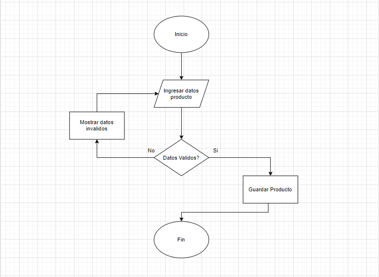
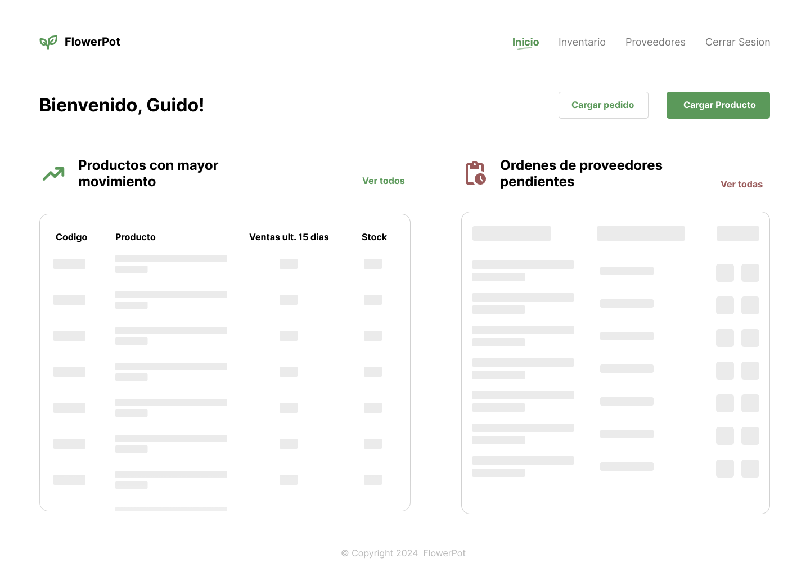
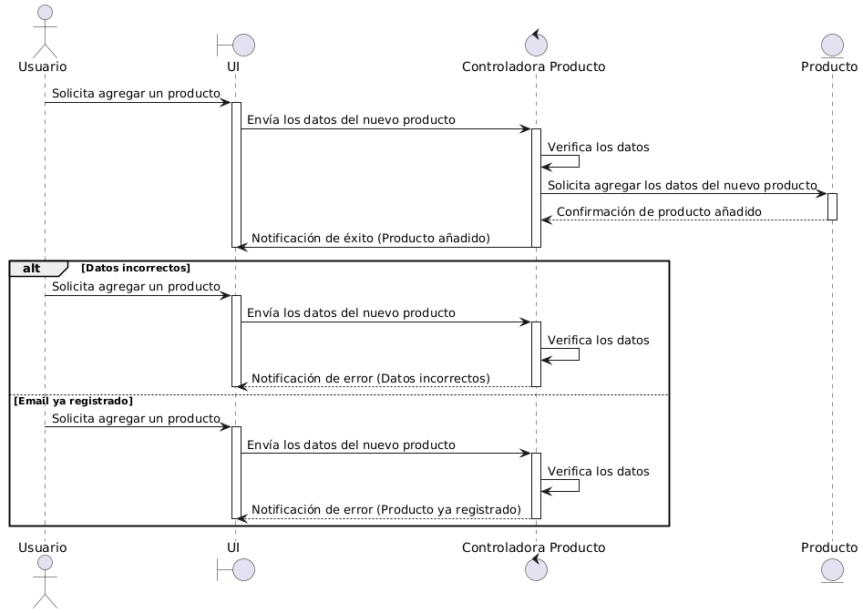
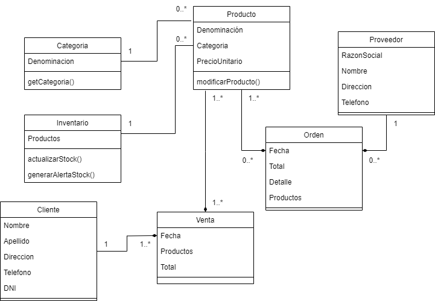

1. Análisis de Requerimientos:

Ejercicio 1: Un cliente te solicita una aplicación web para gestionar su inventario. Define los requisitos funcionales y no funcionales del sistema.

### Requisitos funcionales

1. Gestionar productos

- 1.1: El sistema debera permitir cargar un producto.
- 1.2: El sistema debera permitir modificar un producto.
- 1.3: El sistema debera permitir eliminar un producto.
- 1.4: El sistema debera permitir modificar el stock de un producto.

2. Gestionar ordenes

- 2.1: El sistema debera permitir cargar una nueva orden.
- 2.2: El sistema debera permitir modificar una orden.
- 2.3: El sistema debera permitir eliminar una orden.

3. Gestionar proveedores

- 3.1: El sistema debera permitir cargar una nuevo proveedor.
- 3.2: El sistema debera permitir modificar un proveedor.
- 3.3: El sistema debera permitir suspender un proveedor.
- 3.4: El sistema debera permitir ver los proveedores suspendidos.

4. Informes y reportes

- 4.1: El sistema debera mostrar la deuda con cada proveedor
- 4.2: El sistema debera mostrar la deuda total a proveedores
- 4.3: El sistema debera mostrar un listado de los productos con un stock menor a 3 unidades

### Requisitos no funcionales

**Rendimiento:**

- Tiempo de Respuesta: El sistema debe tener un tiempo de respuesta de menos de 2 segundos para la mayoría de las operaciones.

**Seguridad:**

- Autenticación y Autorización: Implementar mecanismos seguros de autenticación y autorización.
- Protección de Datos: Asegurar que los datos del inventario y los datos de los usuarios estén protegidos contra accesos no autorizados.

**Disponibilidad:**

- Uptime: El sistema debe estar disponible al menos el 99.5% del tiempo.
- Recuperación ante Fallos: Implementar estrategias de recuperación para minimizar el tiempo de inactividad en caso de fallos.

**Usabilidad:**

- Facilidad de Uso: El sistema debe ser fácil de usar para usuarios con diferentes niveles de experiencia técnica.

Ejercicio 2: **Redacta un caso de uso para la funcionalidad de "Agregar un nuevo producto" en la aplicación web del ejercicio 1.**

Caso de uso: Agregar nuevo producto
Actor: usuario
Fecha: 07/05/24
Autor: Cardarelli Guido

Pre-condicion: Haber ingresado al sistema y presionado 'agregar producto'

Flujo normal:

1\_ El sistema muestra un formulario con los campos requeridos.

2\_ El usuario completa los datos requeridos.

3\_ El sistema valida los datos ingresados.

4\_ El usuario presiona cargar.

5\_ El sistema almacena el producto en la base de datos.

Excepciones:
3\_ El sistema detecta datos invalidos

3.1\_ El sistema muestra un mensaje de error

3.2\_ El sistema permite al usuario corregir los mismos.

4\_ El usuario presiona calcelar.

Post-condicion: Se agrego un producto satisfactoriamente

2. Diseño del Sistema:

Ejercicio 3: Elabora un diagrama de flujo de datos para la aplicación web del ejercicio 1.



Ejercicio 4: Diseña la interfaz de usuario para la pantalla de "Inicio" de la aplicación web del ejercicio 1.



[Link del archivo de diseño en figma](https://www.figma.com/file/YkfXHIof2AsgteQEfmSYFi/Metodologias-Agiles---TP-1?type=design&node-id=0-1&mode=design)

3. Diseño del Programa:

Ejercicio 5: Elige una arquitectura adecuada para la aplicación web
del ejercicio 1 y justifica tu elección.

Basado en que se trata en una aplicacion web iria por una arquitectura cliente servidor apoyada en una API REST.

Ejercicio 6: Diseña la base de datos para la aplicación web del ejercicio 1.

En mi caso iria por una base de datos relacional, MySQL para ser especifico.

Creo que seria mas conveniente para este caso de uso un modelo relacional ya que permite ver las distintas entidades del negocio de manera clara y bien definida.

El uso de MySQL por sobre otros sistemas de gestion de base de datos relaciones se debe simplemente a que tengo mayor familiaridad con el mismo dada a que lo he utilizado en varios proyectos.

A modo de bosquejo podria definir las siguientes tablas en base al breve enunciado:

- producto
- categoria_producto
- proveedor
- cliente
- venta (producto_cliente)
- orden (producto_proveedor)
- estado_orden

4. Diseño:

Utilizando los siguientes diagrama resuelva los casos de usos de los ejercicios 7 y 8:

- Diagrama de Secuencia: Describe la interacción entre los diferentes objetos del sistema.



- Diagrama de Clases: Define las clases, sus atributos, métodos y relaciones



5. Pruebas:

Ejercicio 9: Define un conjunto de pruebas unitarias para la funcionalidad de "Agregar un nuevo producto" en la aplicación web del ejercicio 1.

A modo de ejemplo un test utilizando vitest

```
  test('agregar un nuevo producto',()=>{
    const products = []
    const newProduct = {
      name: 'Teclado',
      qty: 1,
      category: ['perifericos']
    }

    products.push(newProduct)

    expect(products).toEqual({
      qty: 1,
      categories: expect.arrayContaining(['perifericos'])
    })
  })
```

6. Despliegue del Programa:

Ejercicio 11: Definir un plan de despliegue para la aplicación web del ejercicio 1.

Dado que probablemente opte por un frontend con React y un backend con node.

Para hostear el front probablemente utilizaria alguna solucion como netlify o vercel ya que permiten despegar proyectos de manera rapida y sencilla. Teniendo tiers de uso gratuito cuando el trafico no es lo suficientemente grande.

Para hostear el backend en node hay alternativas interesantes como railway o fly.io, no tuve la oportunidad de utilizarlas pero tengo entendido que son bastante elegidas en el mercado.

Luego para la base de datos hay soluciones como PlanetScale y Supabase pero tenemos que tener en cuenta el presupuesto del cliente si decidimos ir por alguno de estos servicios ya que la mayoria son de pago.

7. Mantenimiento:

Ejercicio 13: Definir un plan de mantenimiento para la aplicación web del ejercicio 1.

Para el plan de mantenimiento decidí consultar a un agente de IA ya que no tengo conocimiento o experiencia en el mantenimiento de un sistema en producción de un cliente. Me parecio muy interesante lo propuesto ya que toca todos los diferentes puntos a tener en cuenta a la hora de mantener un sistema y además me dio una vision general sobre como pensar el mantenimiento a futuro.

### Plan de Mantenimiento

#### 1. **Mantenimiento Correctivo**

**Objetivo:** Corregir errores o fallos que ocurran durante el uso de la aplicación.

- **Registro de Incidentes:** Implementar un sistema para que los usuarios puedan reportar errores. Puede ser un sistema de tickets o un formulario dentro de la aplicación.
- **Diagnóstico de Errores:** Analizar los reportes de errores para identificar su causa.
- **Corrección:** Solucionar los errores identificados.
- **Pruebas:** Realizar pruebas para asegurar que los errores han sido corregidos sin introducir nuevos problemas.
- **Documentación:** Actualizar la documentación con los detalles de los errores y sus soluciones.

#### 2. **Mantenimiento Adaptativo**

**Objetivo:** Adaptar la aplicación a nuevos entornos o tecnologías.

- **Actualización de Software y Bibliotecas:** Regularmente actualizar las bibliotecas y dependencias utilizadas por la aplicación.
- **Migración:** Planificar y ejecutar la migración de la aplicación a nuevos servidores o plataformas si es necesario.

#### 3. **Mantenimiento Perfectivo**

**Objetivo:** Mejorar la eficiencia y la usabilidad de la aplicación.

- **Optimización de Código:** Revisar y optimizar el código para mejorar el rendimiento.
- **Mejoras en la Interfaz de Usuario:** Realizar mejoras en la interfaz para hacerla más intuitiva y fácil de usar.
- **Nuevas Funcionalidades:** Implementar nuevas funcionalidades basadas en las solicitudes y necesidades de los usuarios.

#### 4. **Mantenimiento Preventivo**

**Objetivo:** Prevenir la ocurrencia de problemas futuros.

- **Revisión de Seguridad:** Realizar revisiones periódicas de seguridad para identificar y corregir vulnerabilidades.
- **Monitoreo de Rendimiento:** Implementar herramientas de monitoreo para vigilar el rendimiento de la aplicación y detectar posibles problemas antes de que afecten a los usuarios.
- **Backups Regulares:** Establecer un sistema de copias de seguridad regulares para prevenir la pérdida de datos.

### Cronograma de Mantenimiento

#### Mensual

- **Revisión de Incidentes:** Analizar y resolver los reportes de errores.
- **Actualización de Dependencias:** Verificar y actualizar bibliotecas y dependencias.
- **Monitoreo de Rendimiento:** Revisar los informes de monitoreo de rendimiento y tomar acciones correctivas si es necesario.

#### Trimestral

- **Optimización de Código:** Revisar y optimizar el código base.
- **Revisión de Seguridad:** Realizar un análisis de seguridad y aplicar los parches necesarios.
- **Evaluación de Nuevas Funcionalidades:** Revisar las solicitudes de nuevas funcionalidades y planificar su desarrollo.

#### Anual

- **Revisión de Plataforma:** Evaluar la necesidad de migrar a nuevas plataformas o tecnologías.
- **Revisión Completa de la Aplicación:** Realizar una revisión exhaustiva de la aplicación para identificar posibles áreas de mejora.

### Herramientas y Recursos

- **Sistema de Gestión de Incidentes:** Jira, Trello, o cualquier otra herramienta de gestión de proyectos.
- **Control de Versiones:** GitHub, GitLab, o Bitbucket.
- **Monitoreo:** New Relic, Grafana, o cualquier otra herramienta de monitoreo.
- **Pruebas de Seguridad:** OWASP ZAP, Nessus, o cualquier otra herramienta de análisis de seguridad.
- **Backup:** Implementar scripts de backup automatizados o utilizar servicios de backup en la nube.
