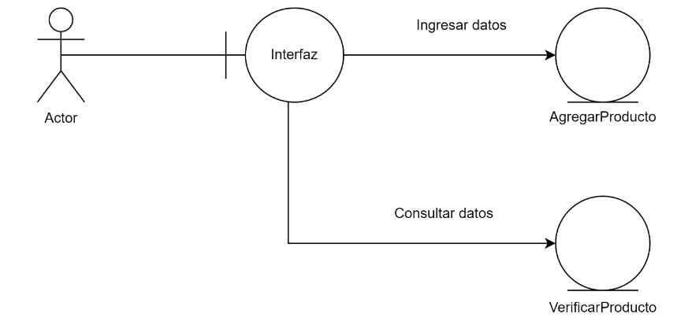

__- TP Ejercicio 8 y 9:__

__- Ejercicio 8: Ejercicios sobre Metodologías de Desarrollo en Cascada.__

1. Análisis de requerimientos:
    - Ejercicio 1: Un cliente te solicita una aplicación web para gestionar su inventario. Define los requisitos funcionales y no funcionales del sistema.
    - Requisitos Funcionales
        - Autenticación y Autorización:
            - Los usuarios deben poder registrarse y autenticarse.
            - Diferentes niveles de acceso (administrador, empleado).
        - Gestión de Productos:
            - Agregar un nuevo producto.
            - Editar información de un producto existente.
            - Eliminar un producto.
            - Buscar y visualizar productos.
        - Gestión de Inventario:
            - Actualizar el stock de productos.
            - Notificar cuando el stock de un producto esté bajo un umbral definido.
        - Informes y Estadísticas:
            - Generar informes de inventario.
            - Visualizar estadísticas de ventas y stock.
    - Requisitos No Funcionales
        - Rendimiento:
            - La aplicación debe ser capaz de manejar múltiples solicitudes simultáneas sin degradar el rendimiento.
        - Seguridad:
            - Los datos de los usuarios y productos deben ser protegidos mediante encriptación.
            - La aplicación debe cumplir con las normativas de protección de datos.
        - Escalabilidad:
            - La arquitectura del sistema debe permitir la adición de nuevas funcionalidades sin grandes cambios.
        - Usabilidad:
            - La interfaz de usuario debe ser intuitiva y fácil de usar.
        - Compatibilidad:
            - La aplicación debe ser accesible desde los principales navegadores web.

    - Ejercicio 2: Redacta un caso de uso para la funcionalidad de "Agregar un nuevo producto" en la aplicación web del ejercicio 1.
    - Caso de Uso
        
        

2. Diseño del sistema:
    - Ejercicio 3: Elabora un diagrama de flujo de datos para la aplicación web del ejercicio 1.
    - Diagrama de flujo
        
        

    - Ejercicio 4: Diseña la interfaz de usuario para la pantalla de "Inicio" de la aplicación web del ejercicio 1.
    - Interfaz de usuario

        

3. Diseño del Programa:
    - Ejercicio 5: Elige una arquitectura adecuada para la aplicación web del ejercicio 1 y justifica tu elección.
    - Arquitectura
        - Arquitectura en Capas (Multicapa):
            - Capa de Presentación: Interfaz de usuario accesible desde navegadores web.
            - Capa de Negocio: Lógica de la aplicación, reglas de negocio y validación.
            - Capa de Datos: Acceso y manipulación de la base de datos.
        - Se ha elegido esta arquitectura por:
            - Separación de responsabilidades: Facilita el mantenimiento y la escalabilidad del sistema.
            - Reutilización de componentes: Las capas pueden ser desarrolladas y probadas de manera independiente.
            - Facilidad de pruebas: Cada capa puede ser probada de manera aislada, mejorando la calidad del software.
    
    - Ejercicio 6: Diseña la base de datos para la aplicación web del ejercicio 1.
    - Para diseñar la base de datos de la aplicación web para gestionar el inventario, se ha optado por un modelo relacional. Este tipo de base de datos es ideal para aplicaciones donde la integridad de los datos, las relaciones entre diferentes entidades y la capacidad de realizar consultas complejas son cruciales. Las bases de datos relacionales, como MySQL, PostgreSQL, y otros, ofrecen robustez, escalabilidad y soporte para transacciones, lo que garantiza que las operaciones se ejecuten correctamente y que los datos se mantengan consistentes.

    - Las tablas quedarian de la siguiente manera:
        Productos
        -id_producto (PK)
        -nombre
        -descripción
        -categoría
        -precio
        -stock

        Usuarios
        -id_usuario (PK)
        -nombre_usuario
        -contraseña
        -rol (administrador, empleado)

        Movimientos de Inventario
        -id_movimiento (PK)
        -id_producto (FK)
        -cantidad
        -tipo (entrada, salida)
        -fecha

        Reportes
        -id_reporte (PK)
        -id_usuario (FK)
        -fecha
        -tipo

4. Diseño:
    - Utilizando los siguientes diagrama resuelva los casos de usos de los  ejercicios 7 y 8: 
        - Diagrama de Dominio: Identifica las entidades, atributos y relaciones del sistema.                 
        - Diagrama de Robustez: Analiza cómo el sistema responde a diferentes escenarios de uso.             
        - Prototipo: Crea una versión simplificada del sistema para probar la usabilidad y funcionalidad.    
        - Diagrama de Secuencia: Describe la interacción entre los diferentes objetos del sistema.           
        - Diagrama de Clases: Define las clases, sus atributos, métodos y relaciones                         
 
    
    - Ejercicio 7: Implementa la funcionalidad de "Agregar un nuevo producto" en la aplicación web del ejercicio 1 utilizando el lenguaje de programación de tu preferencia.
    - (Es Codificacion --> No se hace)

    - Ejercicio 8: Implementa la lógica de negocio para la funcionalidad de "Agregar un nuevo producto" en la aplicación web del ejercicio 1.
    - Modelo de dominio

        

    - Diagrama de robustez

        
   
    - Diagrama de secuencia

        

    - Diagrama de clases

        

5. Pruebas:
    - Ejercicio 9: Define un conjunto de pruebas unitarias para la funcionalidad de "Agregar un nuevo producto" en la aplicación web del ejercicio 1.
    - Pruebas Unitarias
        - Verificar que se puede agregar un producto con datos válidos.
        - Verificar que no se puede agregar un producto con nombre vacío.
        - Verificar que no se puede agregar un producto con precio negativo.
        - Verificar que se muestra un mensaje de confirmación al agregar un producto correctamente.

    - Ejercicio 10: Ejecuta pruebas de integración para la funcionalidad de "Agregar un nuevo producto" en la aplicación web del ejercicio 1.
    - Pruebas de Integración
        - Verificar que la funcionalidad de agregar producto se comunica correctamente con la base de datos
        - Verificar que los datos del producto agregado se muestran correctamente en la lista de productos
        - Verificar que las validaciones de la interfaz de usuario coinciden con las validaciones de la lógica de negocio.

6. Despliegue del Programa::
    - Ejercicio 11: Definir un plan de despliegue para la aplicación web del ejercicio 1.
    - Plan de Despliegue
        - Preparación:
            - Realizar pruebas finales en un entorno de pre-producción.
            - Documentar el proceso de despliegue.
            - Configurar backups automáticos.
        - Despliegue:
            - Configurar el servidor de producción.
            - Migrar la base de datos al entorno de producción.
            - Implementar el código de la aplicación en el servidor.
            - Configurar el dominio y el SSL.
        - Post-Despliegue:
            - Monitorear el rendimiento y la disponibilidad del sistema.
            - Realizar pruebas funcionales para verificar el despliegue exitoso.
            - Documentar cualquier incidencia y solución.

    - Ejercicio 12: Despliega la aplicación web del ejercicio 1 en un servidor de producción.
    - Despliegue en servidor de producción
        1. Configurar el servidor (por ejemplo, utilizando AWS, Azure, DigitalOcean).
        2. Instalar dependencias (servidor web, base de datos, etc.).
        3. Subir el código fuente y configurar el entorno.
        4. Ejecutar scripts de migración de base de datos.
        5. Configurar el dominio y SSL.
        6. Realizar pruebas funcionales y de rendimiento.

7. Mantenimiento:
    - Ejercicio 13: Definir un plan de mantenimiento para la aplicación web del ejercicio 1.
    - Plan de mantenimiento
        - Mantenimiento Preventivo:
            - Actualizar regularmente el sistema operativo y las dependencias del servidor.
            - Realizar auditorías de seguridad periódicas.
            - Monitorear el rendimiento del sistema.
        - Mantenimiento Correctivo:
            - Solucionar errores reportados por los usuarios.
            - Aplicar parches de seguridad.
        - Mantenimiento Evolutivo:
            - Añadir nuevas funcionalidades según los requisitos del cliente.
            - Mejorar la interfaz de usuario basada en feedback de usuarios.

    - Ejercicio 14: Implementa una corrección de errores para un problema detectado en la aplicación web del ejercicio 1.
    - Corrección de errores
        - Identificar y reproducir el error.
        - Analizar el código para encontrar la causa del error.
        - Implementar la corrección en el entorno de desarrollo.
        - Realizar pruebas para verificar que el error ha sido solucionado.
        - Desplegar la corrección en el entorno de producción.
        - Documentar el error y su solución.

8. Equipo de trabajo:
    - Ejercicio 15: Arme un equipo de trabajo y defina los roles para realizar los ejercicios anteriores para un futuro dominio de aplicación relacionado con inteligencia artificial generatica. 
    - Equipo de Trabajo y Roles
        - Jefe de Proyecto: Responsable de la planificación, coordinación y seguimiento del proyecto.
        - Analista de Requerimientos: Encargado de recopilar y definir los requisitos del sistema.
        - Arquitecto de Software: Diseña la arquitectura del sistema y toma decisiones técnicas.
        - Desarrollador Frontend: Desarrolla la interfaz de usuario y asegura su usabilidad.
        - Desarrollador Backend: Implementa la lógica de negocio y la integración con la base de datos.
        - Tester: Diseña y ejecuta pruebas para garantizar la calidad del software.
        - Administrador de Base de Datos: Gestiona y optimiza la base de datos.
        - Especialista en Seguridad: Asegura que el sistema cumpla con los estándares de seguridad.
        - Ingeniero DevOps: Responsable del despliegue y la infraestructura del sistema.
        - Especialista en IA: Desarrolla e implementa modelos de inteligencia artificial generativa.

__- Ejercicio 9: Teniendo en cuenta los nuevos conceptos y habilidades aprendidas del proceso unificado, realiza las mejoras que considere necesario del trabajo práctico del Ejercicio 8.__

- Al aplicar el Proceso Unificado (UP) en lugar del enfoque en cascada, el trabajo práctico tendría resultados similares en términos de funcionalidades y calidad final, pero la forma en que se aborda el trabajo a lo largo del tiempo sería notablemente diferente.
El enfoque en cascada es secuencial, rígido y requiere una planificación exhaustiva al inicio, con poca flexibilidad para cambios posteriores. En cambio, el Proceso Unificado es iterativo e incremental, permitiendo ajustes continuos y mejoras basadas en el feedback continuo.
A continuación se detallará cómo cada enfoque afecta el proceso del desarrollo del trabajo:

1. Análisis de Requerimientos

- Cascada:
    - Secuencial y Rígido: Los requisitos funcionales y no funcionales se definen exhaustivamente al inicio del proyecto. No hay cambios significativos permitidos una vez que se pasa a la siguiente fase.
    - Documentación Completa: Los requisitos se documentan detalladamente antes de proceder a la fase de diseño.
  
- Proceso Unificado:
    - Iterativo e Incremental: Los requisitos se desarrollan y refinan a lo largo de múltiples iteraciones. Se permite y se espera la evolución de los requisitos a medida que se adquiere más conocimiento del sistema.
    - Desarrollo Evolutivo: Se crean versiones preliminares y prototipos para validar y refinar los requisitos continuamente.

2. Diseño del Sistema

- Cascada:
    - Fase de Diseño Estática: El diseño del sistema se realiza una sola vez después de completar el análisis de requisitos. Este diseño incluye diagramas de flujo de datos y la interfaz de usuario.
    - Diseño Detallado Inicial: Todo el sistema se diseña en detalle antes de comenzar la implementación.

- Proceso Unificado:
    - Diseño Evolutivo: El diseño del sistema se desarrolla en ciclos, permitiendo ajustes basados en el feedback de las implementaciones y pruebas anteriores.
    - Prototipos y Modelos: Se utilizan prototipos y modelos incrementales para validar los diseños antes de proceder con cada iteración.

3. Diseño del Programa

- Cascada:
    - Arquitectura Definida Temprano: Se elige una arquitectura adecuada al principio y se justifica una vez.
    - Diseño de Base de Datos Completo: La base de datos se diseña completamente antes de comenzar la implementación del código.

- Proceso Unificado:
    - Arquitectura Iterativa: La arquitectura puede evolucionar a lo largo del proyecto. Se justifica y ajusta en cada iteración según las necesidades.
    - Diseño Incremental de la Base de Datos: La base de datos se diseña y ajusta iterativamente, permitiendo cambios basados en el feedback continuo.

4. Diseño (Diagrama de Dominio, Diagrama de Robustez, Prototipo, Diagrama de Secuencia, Diagrama de Clases)

- Cascada:
    - Diseño Completo Inicial: Todos los diagramas y prototipos se crean en una fase de diseño completa antes de la implementación.
    - Secuencial: Los diseños se desarrollan y finalizan secuencialmente sin posibilidad de volver atrás fácilmente.

- Proceso Unificado:
    - Diseño Continuo y Ajustable: Los diagramas y prototipos se desarrollan y ajustan en cada iteración. La robustez y la secuencia pueden cambiar en función de las implementaciones y pruebas.
    - Feedback y Ajustes: El diseño se mejora constantemente basado en pruebas y feedback de cada iteración.

5. Pruebas

- Cascada:
    - Pruebas al Final del Ciclo: Las pruebas unitarias e integración se realizan después de completar toda la implementación.
    - Fase de Pruebas Distinta: Existe una fase de pruebas bien definida y separada.

- Proceso Unificado:
    - Pruebas Continuas: Las pruebas se realizan continuamente a lo largo del ciclo de vida del proyecto. Cada iteración incluye pruebas unitarias e integración.
    - Integración Continua: Las pruebas de integración se realizan continuamente para asegurar que los componentes del sistema funcionan juntos a lo largo de todo el desarrollo.

6. Despliegue del Programa

- Cascada:
    - Despliegue Final: La aplicación se despliega una vez al final del desarrollo completo.
    - Plan de Despliegue Estático: El plan de despliegue se define al inicio y se sigue estrictamente.

- Proceso Unificado:
    - Despliegue Incremental: Se realizan despliegues incrementales y frecuentes. Cada iteración puede resultar en una versión desplegable.
    - Plan de Despliegue Evolutivo: El plan de despliegue se ajusta y mejora continuamente a lo largo del proyecto.

7. Mantenimiento

- Cascada:
    - Mantenimiento Post-Despliegue: El mantenimiento se inicia después del despliegue final. Las correcciones y mejoras se implementan después de la entrega completa del proyecto.
    - Cambios Costosos: Los cambios y correcciones pueden ser costosos y complejos debido a la falta de iteraciones previas.

- Proceso Unificado:
    - Mantenimiento Continuo: El mantenimiento es continuo a lo largo de todo el ciclo de vida del proyecto. Las correcciones se implementan en cada iteración.
    - Cambios Menos Costosos: Los cambios y correcciones se incorporan más fácilmente debido a la naturaleza iterativa del proceso.

8. Preparación para Nuevos Retos

- Cascada:
    - Planeación Lineal: La preparación para nuevos proyectos se planifica después de finalizar el proyecto actual.
    - Roles y Responsabilidades Fijos: Los roles del equipo se definen al inicio y rara vez cambian.

- Proceso Unificado:
    - Planeación Adaptativa: La preparación para nuevos proyectos se puede realizar en paralelo, ajustando roles y responsabilidades según las necesidades de cada iteración.
    - Roles Flexibles: Los roles del equipo pueden adaptarse y cambiar según las necesidades de cada fase del proyecto.